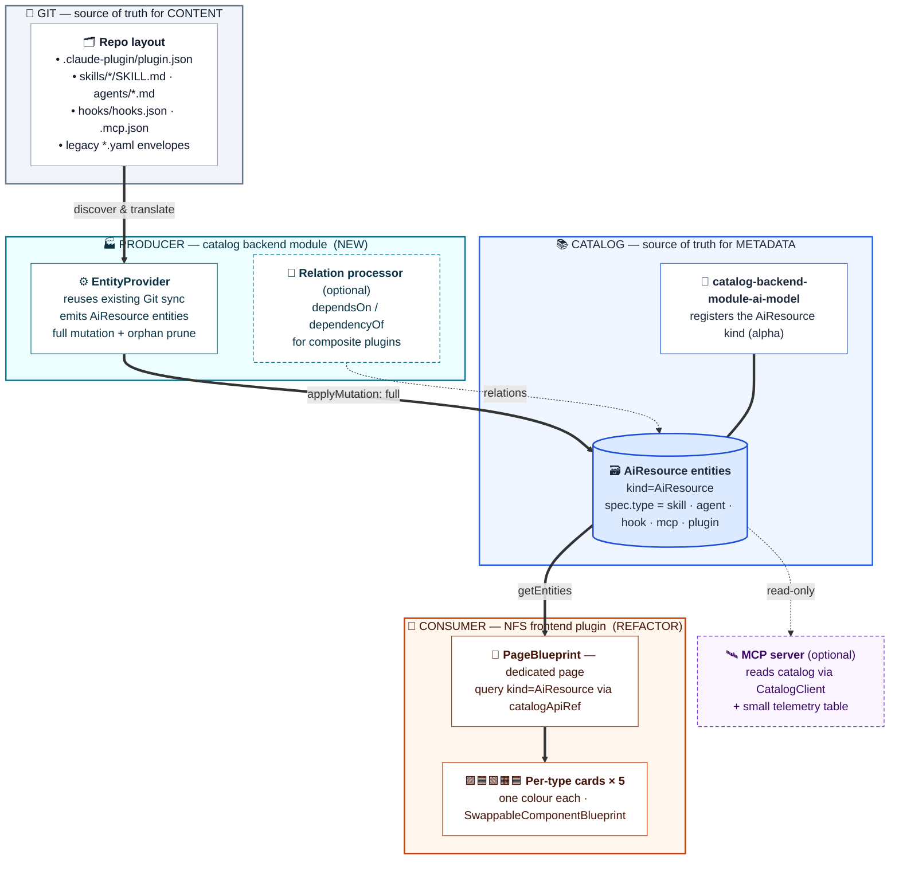
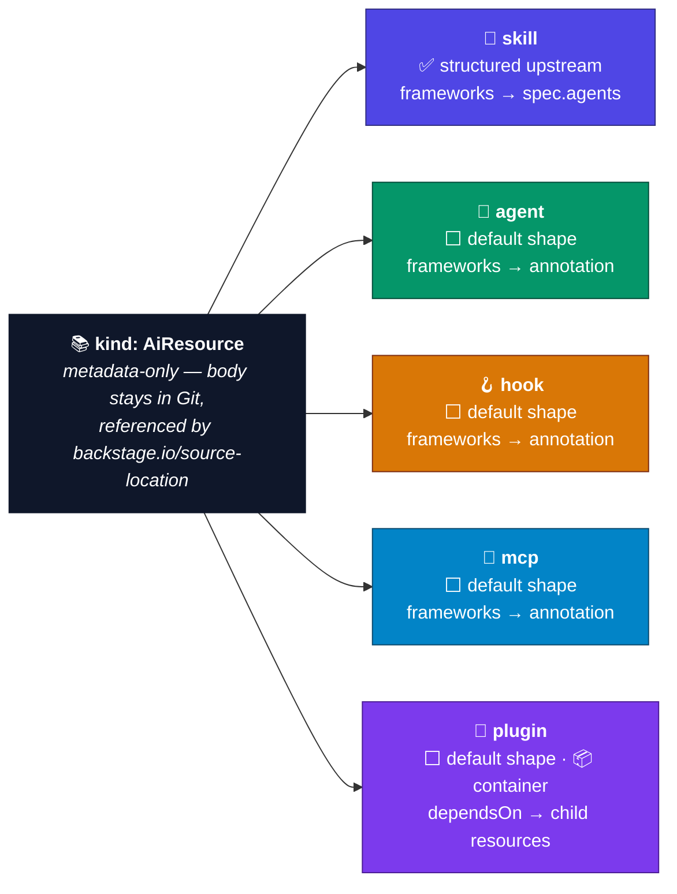
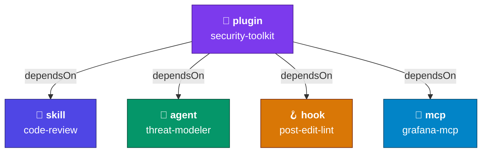
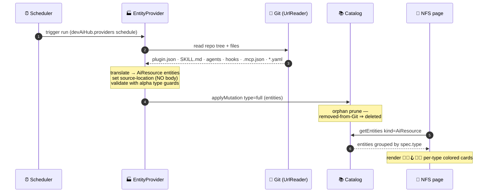
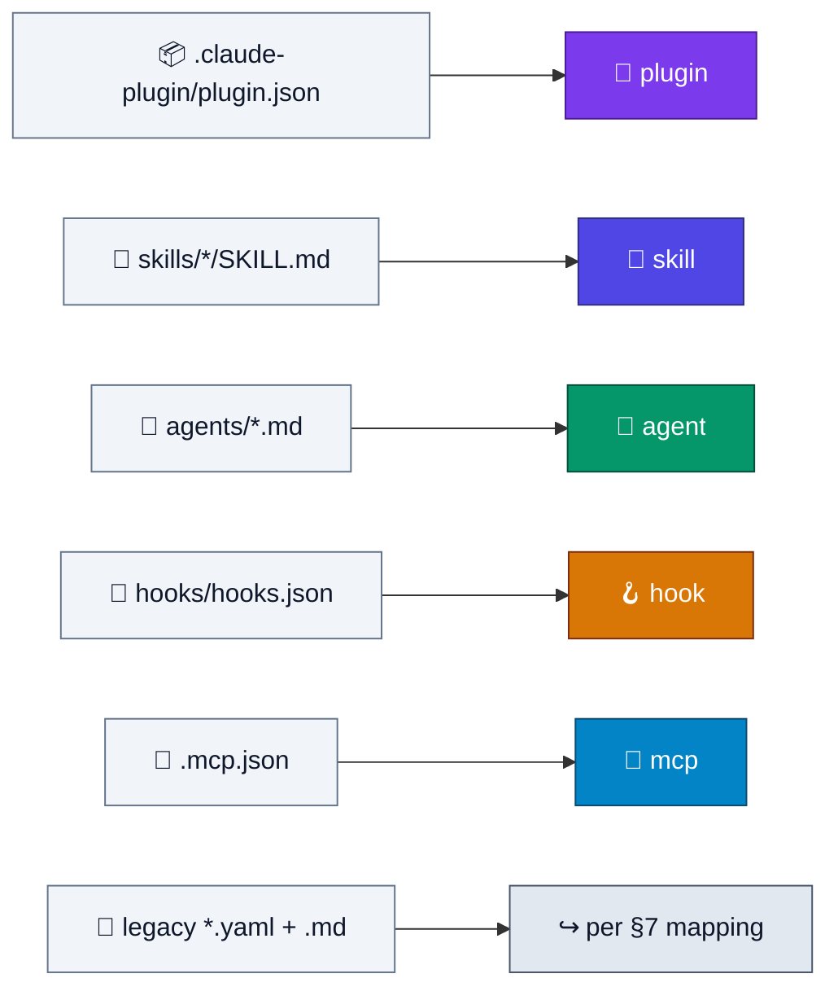

# DevAI Hub → `AiResource` Catalog Refactor — Spec, Plan & Roadmap

> **Status:** Draft `v0.2` — living document. This is an *initial* draft intended to grow.
> Every section ends open: amend in place, then record the change in §11 (Change Log) and
> any unresolved questions in §10 (Open Questions). Nothing here is frozen except the
> tenets in §2, which are the load-bearing decisions the rest of the document hangs off.
>
> **Tracked Backstage:** `v1.51.0+` · **Frontend:** New Frontend System (NFS) only.
> **Upstream watch:** `backstage/backstage#34318` (content-in-catalog), AiResource alpha churn.

---

## 0. How to read & evolve this document

- **Normative vs. illustrative.** Code blocks are *illustrative* unless marked `NORMATIVE`.
  The alpha `AiResource` schema is the source of truth; where this doc and the installed
  `@backstage/catalog-model/alpha` disagree, the package wins and this doc is wrong (fix it).
- **Verification flags.** `⚠︎ VERIFY` marks a claim that must be checked against the actually
  installed alpha package before you build on it. These exist because `AiResource` is alpha.
- **Extension seams.** `↘ GROWS HERE` marks the spots designed to absorb future types,
  future structured subtypes, and upstream corrections without a rewrite.

---

## 1. Goals & non-goals

### Goals
1. Put AI assets in the **software catalog as first-class `AiResource` entities**, using the
   *native* `@backstage/plugin-catalog-backend-module-ai-model` — not a custom kind, not a
   private store. The catalog becomes the single source of truth.
2. Support, initially, five `spec.type` values: **`skill`, `agent`, `hook`, `mcp`, `plugin`**.
   The `plugin` type follows the Claude Code plugin spec (https://code.claude.com/docs/en/plugins).
3. Ship a **dedicated NFS page** in the DevAI Hub plugin that *reads discovered `AiResource`
   entities from the catalog* and renders **one card style per type, each with its own colour**.
4. Keep entities **metadata-only**: typical Backstage metadata + usage metadata (compatibility
   framework: `claude`, `gemini`, `cursor`, `github-copilot`, …). **No skill/agent body** in the
   entity — the body stays in Git, referenced by `backstage.io/source-location`.
5. Leave a **sustainable, upstream-convergent path**: as Backstage adds structured subtypes and
   content references, we adopt them and delete our stopgaps. No siloed components.

### Non-goals (for now)
- Storing asset **content/bodies** in the catalog (explicitly out — see §4.4 and #34318).
- Defining a **custom catalog kind** or fork of `AiResource`. We consume the native kind.
- Replicating the plugin's **embedded MCP runtime** as catalog data. The MCP server, if kept,
  becomes a thin *reader* of the catalog (§6.4); only mutable telemetry stays plugin-owned.
- A migration of the **legacy frontend system**. NFS only.

---

## 2. Architectural tenets (the decisions everything else depends on)

| # | Tenet | Consequence |
|---|-------|-------------|
| T1 | **Catalog is the source of truth.** | Discovery emits entities *into* the catalog; UI reads *from* it. No parallel asset DB as a system of record. |
| T2 | **Plugin is producer + consumer, never owner of the kind.** | A catalog *backend module* (EntityProvider) produces `AiResource`s; an NFS *frontend plugin* consumes them. The kind itself is owned by `@backstage/plugin-catalog-backend-module-ai-model`. |
| T3 | **Entities are metadata-only.** | Body lives in Git; entity carries a `backstage.io/source-location` pointer. This matches the upstream design exactly — `AiResource` deliberately stores no content. |
| T4 | **Native structured subtype where it exists; default shape + namespaced annotations elsewhere.** | `skill` is structured upstream today; `agent`/`hook`/`mcp`/`plugin` use the default `AiResource` shape + our annotation namespace until upstream structures them. |
| T5 | **Composite plugins model containment via relations.** | A Claude Code `plugin` is a *container* of skills/agents/hooks/mcp; model it as an `AiResource` that `dependsOn` (or has-part) its child `AiResource`s — the System→Component pattern. |
| T6 | **Converge, don't entrench.** | Every stopgap (annotation, custom relation processor, content resolver) has a documented exit condition tied to an upstream milestone (§9). |

---

## 3. Target architecture

Three layers, three packages, one data flow: **content lives in Git → a producer emits
`AiResource`s into the catalog → an NFS consumer reads them back**. The first two packages are
new; the third is the refactored frontend.



**Legend.** Thick arrows `══>` = the primary write/read path; dashed `┄┄>` = optional/relations;
`═══` (no arrow) = "enables/registers". Layer colours: 📁 grey = Git, 🏭 cyan = producer,
📚 blue = catalog, 🎨 orange = consumer, 🛰️ violet-dashed = optional. The five *type* colours
(🧠🤖🪝🔌🧩) are introduced in §4 and reused identically on the cards in §5.3 — same hue, same
meaning, everywhere in this spec.

**Package layout (proposed):**

| Package | Role | Key deps |
|---|---|---|
| `@julianpedro/plugin-catalog-backend-module-dev-ai-hub` *(new)* | Producer. `EntityProvider` (+ optional relation processor). Reuses the existing Git sync logic. | `@backstage/plugin-catalog-node`, `@backstage/backend-plugin-api`, `@backstage/catalog-model/alpha` |
| *(app backend wiring)* | Install `@backstage/plugin-catalog-backend-module-ai-model` + the module above; allow `AiResource` in `catalog.rules`. | — |
| `@julianpedro/plugin-dev-ai-hub` *(refactor)* | Consumer. NFS frontend: dedicated page + per-type cards, reads catalog. | `@backstage/frontend-plugin-api`, `@backstage/plugin-catalog-react`, `@backstage/plugin-catalog-react/alpha` |
| `@julianpedro/plugin-dev-ai-hub-common` *(slim down)* | Shared TS types for the *annotation/spec usage-metadata contract* and the framework vocabulary. The asset DB types retire over time. | — |
| `@julianpedro/plugin-dev-ai-hub-backend` *(repurpose / retire)* | If kept: thin catalog-backed MCP reader + telemetry. The asset REST API and asset tables are deprecated. | `@backstage/catalog-client` |

> ↘ GROWS HERE: adding a sixth type later touches only (a) the producer's translator, (b) the
> type→card registry in the frontend, and (c) §7. No schema migration, no new kind.

---

## 4. Entity model

The five target types are **one kind (`AiResource`) with five `spec.type` values**. Each type's
colour below is the *same* colour used for its card in §5.3 — the colour is the component's
identity across the whole system.



✅ = a structured subtype exists upstream today (use native spec fields). ⬜ = default
`AiResource` shape for now, carried by namespaced annotations until upstream structures it (T4).

### 4.1 Common shape (all five types)

```yaml
# NORMATIVE shape for the fields we control; spec subtype fields per §4.3
apiVersion: backstage.io/v1alpha1
kind: AiResource
metadata:
  name: <normalized-kebab-name>          # must satisfy the catalog name regex
  title: <human label>                   # was: asset.label
  description: <one-liner>
  tags: [<...>]                          # was: asset.tags
  annotations:
    backstage.io/source-location: url:https://github.com/org/repo/blob/main/<path>
    backstage.io/managed-by-location: <provider>:<...>
    backstage.io/managed-by-origin-location: <provider>:<...>
    devaihub/version: "1.2.0"            # see §4.5 on the namespace
    devaihub/compatible-frameworks: "claude,cursor,github-copilot"
spec:
  type: skill | agent | hook | mcp | plugin
  lifecycle: production | experimental | deprecated
  owner: group:ai-platform-team          # entity ref; was: asset.author
  # system?, plus subtype-specific fields per §4.3
```

The base `AiResource` spec is `{ type, lifecycle, owner, system? }`. `metadata.name`/`title`/
`description`/`tags`/`annotations` are standard Backstage metadata and carry everything the
plugin's current asset envelope expressed except the body.

### 4.2 Field mapping — current asset envelope → `AiResource`

| Current plugin field | Target | Notes |
|---|---|---|
| `type: instruction\|agent\|skill\|workflow` | `spec.type` | Remapped to the new vocabulary (`skill`/`agent`/`hook`/`mcp`/`plugin`); see §7 for `instruction`/`workflow` disposition. |
| `name` | `metadata.name` | Normalize to the name regex; keep the original in an annotation if lossy. |
| `label` | `metadata.title` | |
| `description` | `metadata.description` | |
| `tags` | `metadata.tags` | |
| `author` | `spec.owner` | Resolve to a `group:`/`user:` ref where possible; else annotation. |
| `tools` (`claude-code`, `cursor`, …) | `spec.agents` (skill) **or** `devaihub/compatible-frameworks` (others) | The compatibility-framework field. See §4.4. |
| `version` | `devaihub/version` annotation | No native spec field. |
| `installPath` / `installPaths` | `devaihub/install-path-<framework>` annotations | No native spec field; per-framework. |
| markdown `content` / `SKILL.md` body | **dropped from entity**; `backstage.io/source-location` | Tenet T3. Resolve on demand (§4.4, §6.4). |
| `installCount` / popularity | **stays in plugin telemetry table** | Mutable runtime metric — not catalog truth (T1 caveat). |

### 4.3 Per-type spec (structured where upstream allows)

- **`skill` — STRUCTURED upstream.** Use the native skill subtype fields. Per the alpha model /
  originating RFC the skill spec is roughly
  `{ type: 'skill', disciplines?: string[], categories?: string[], agents?: string[], usecases?: string[], allowedTools?: string[] }`,
  where `agents` = the AI tools the skill targets (`claude-code`, `copilot`, …). **Map our
  compatibility-framework vocabulary onto `spec.agents`** for skills. `⚠︎ VERIFY` exact field
  names against the installed `@backstage/catalog-model/alpha`.
- **`agent`, `hook`, `mcp`, `plugin` — DEFAULT shape (unstructured) today.** Base spec only,
  plus our namespaced annotations / additive spec fields per §4.4. `↘ GROWS HERE`: when upstream
  ships a structured subtype for any of these, migrate that type's annotations into the official
  spec and drop the annotation (exit condition in §9, Phase 4).

### 4.4 Compatibility framework ("usage metadata") — the one field you must get right

This is the field that makes the cards useful and is the most likely to gain native structure.
Design it twice so it survives upstream changes:

1. **Skill (structured):** put frameworks in `spec.agents` (native).
2. **All other types (until structured):** put them in **both**
   - an additive spec field `spec.frameworks: string[]` *(only if the installed alpha validator
     permits unknown spec fields — `⚠︎ VERIFY` whether the AiResource schema sets
     `additionalProperties: false`; if it does, skip this and use annotations only)*, **and**
   - a free-form annotation `devaihub/compatible-frameworks: "claude,cursor,github-copilot"`
     (always safe — annotations are unconstrained strings).

**Controlled vocabulary** (define once in `-common`, `↘ GROWS HERE`):

| Token | Meaning |
|---|---|
| `claude` / `claude-code` | Anthropic Claude / Claude Code |
| `gemini` | Google Gemini / Gemini CLI |
| `cursor` | Cursor |
| `github-copilot` | GitHub Copilot |
| `all` | framework-agnostic |

> The frontend renders these as badges on every card and as a filter facet. Keep the canonical
> token list in `@julianpedro/plugin-dev-ai-hub-common` so producer and consumer agree.

### 4.5 Annotation namespace

Pick a **reverse-DNS namespace you own** for all custom annotations (e.g. `devaihub.<org>/…` or
the plugin's published namespace). Used above as `devaihub/…` for brevity — replace before
shipping. Standardising the namespace now means future structured-subtype migrations are a
mechanical find/replace, not a hunt.

### 4.6 Composite `plugin` → relations (T5)

A Claude Code plugin is a directory with `.claude-plugin/plugin.json` that *contains* skills
(`skills/*/SKILL.md`), agents (`agents/*.md`), hooks (`hooks/hooks.json`), and MCP servers
(`.mcp.json`). Model it as a parent `AiResource` (`spec.type: plugin`) that **declares its
children as dependencies**:

```yaml
# plugin entity (illustrative)
apiVersion: backstage.io/v1alpha1
kind: AiResource
metadata:
  name: security-toolkit
  title: Security Toolkit
  description: Bundled skills, agents and hooks for security review
  annotations:
    backstage.io/source-location: url:https://github.com/org/repo/tree/main/security-toolkit
    devaihub/plugin-manifest: "true"
    devaihub/version: "1.0.0"
spec:
  type: plugin
  lifecycle: production
  owner: group:ai-platform-team
  dependsOn:
    - airesource:default/security-toolkit-code-review     # a skill
    - airesource:default/security-toolkit-threat-modeler  # an agent
    - airesource:default/security-toolkit-post-edit-lint  # a hook
```



The catalog emits the inverse `dependencyOf` relation automatically, so each child also points
back to its 🧩 plugin — the `PluginCard` (§5.3) renders the children, and each child card links
up to its container. This is the System→Component pattern applied to AI assets.

`⚠︎ VERIFY` whether the `ai-model` module's processor emits relations from `spec.dependsOn` for
`AiResource`. **If it does**, you get `dependsOn`/`dependencyOf` in the catalog graph for free.
**If it doesn't**, add a tiny processor in the *same* backend module that emits the relations
(`processingResult.relation({ source, type: RELATION_DEPENDS_ON, target })` and its inverse) so
the plugin card can list its parts and the catalog graph renders the containment. Either way the
frontend can render children by reading the plugin entity's relations.

---

## 5. Presentation layer — the dedicated NFS page

### 5.1 Wiring (v1.51 NFS — note the breaking change)

`createFrontendPlugin` + `PageBlueprint`, default-exported from a `/alpha` entrypoint. **Do not
use `NavItemBlueprint` — it was removed in v1.51.0.** The sidebar item is now auto-discovered
from the page's `title` + `icon`.

```tsx
// src/routes.ts  (NORMATIVE pattern)
import { createRouteRef } from '@backstage/frontend-plugin-api';
export const rootRouteRef = createRouteRef();   // no id param in NFS

// src/alpha.tsx
import { createFrontendPlugin, PageBlueprint } from '@backstage/frontend-plugin-api';
import { rootRouteRef } from './routes';
import { DevAiHubIcon } from './icons';

const devAiHubPage = PageBlueprint.make({
  params: {
    routeRef: rootRouteRef,
    path: '/dev-ai-hub',
    title: 'DevAI Hub',     // ← drives the auto-discovered sidebar entry (v1.51)
    icon: <DevAiHubIcon />, // ← ditto
    loader: () => import('./components/DevAiHubPage').then(m => <m.DevAiHubPage />),
  },
});

export default createFrontendPlugin({
  pluginId: 'dev-ai-hub',
  extensions: [devAiHubPage /* + ApiBlueprint, card extensions */],
  routes: { root: rootRouteRef },
});
```

> Note (from your environment): `yarn new` still scaffolds **legacy** frontend wiring as of
> v1.51 — the NFS wiring above (`createFrontendPlugin`, `PageBlueprint`, `/alpha` entrypoint)
> must be applied **manually**. Known CLI gap.

### 5.2 Reading the catalog (consumer)

The page queries the catalog filtered by `kind=AiResource`, then groups by `spec.type`:

```tsx
// inside DevAiHubPage
import { catalogApiRef } from '@backstage/plugin-catalog-react';
import { useApi } from '@backstage/frontend-plugin-api';

const catalogApi = useApi(catalogApiRef);
const { items } = await catalogApi.getEntities({
  filter: { kind: 'AiResource' },
  // optionally: { kind: 'AiResource', 'spec.type': 'skill' } per facet
});
```

For a richer, catalog-native page you can instead drive it with `EntityListProvider` +
`useEntityList` from `@backstage/plugin-catalog-react`, and reuse `EntityKindPicker` /
`EntityTypePicker` / `CatalogFilterLayout` for filtering by type and framework. Precedent worth
copying: in v1.51 the scaffolder template list gained a `groups` config that buckets cards by a
`spec.type` filter predicate — the same grouping idea applies directly to bucketing `AiResource`
cards by type.

### 5.3 Per-type cards, one colour each

One card component per type, selected by `spec.type`, each with a distinct colour. Keep the
mapping in a **typed registry** in `-common` so producer vocabulary and consumer rendering can't
drift, and so adding a type is a one-line change (`↘ GROWS HERE`).

| `spec.type` | Card | Icon | Suggested colour role | Default (light) |
|---|---|---|---|---|
| `skill` | `SkillCard` | 🧠 | `--devaihub-skill` | indigo `#4F46E5` |
| `agent` | `AgentCard` | 🤖 | `--devaihub-agent` | emerald `#059669` |
| `hook` | `HookCard` | 🪝 | `--devaihub-hook` | amber `#D97706` |
| `mcp` | `McpCard` | 🔌 | `--devaihub-mcp` | sky `#0284C7` |
| `plugin` | `PluginCard` | 🧩 | `--devaihub-plugin` | violet `#7C3AED` |

These five (icon + colour) are the **single visual vocabulary** of the system: the same hue and
emoji identify a type in the architecture diagram (§3), the taxonomy (§4), the containment graph
(§4.6), the discovery map (§6.3), and the card itself. Bind the colour roles to theme tokens so
the identity holds in light and dark mode.

Guidance:
- **Use theme tokens, not raw hex.** Bind the roles above to the Backstage UI palette so dark
  mode and org themes work. Raw hex shown only as a starting point.
- **Make cards swappable.** In v1.51 the scaffolder `TemplateCard` became swappable via
  `SwappableComponentBlueprint`; adopt the same pattern so integrators (and NOS) can override a
  card without forking. For entity-page surfaces, expose cards via `EntityCardBlueprint` from
  `@backstage/plugin-catalog-react/alpha`.
- **Card content is metadata-only** (T3): title, description, owner, lifecycle, tags, **framework
  badges** (§4.4), and a "View source" link from `backstage.io/source-location`. No body, no
  rendered SKILL.md. The install/"open body" action resolves the source on demand (§6.4).
- **`PluginCard` is special:** it lists its child resources (from relations, §4.6) and links to
  each child's card — the container view.

> Want a quick visual of the card grid + colour system before building? Say the word and I'll
> render an interactive mockup; it's intentionally left out of this doc to keep the spec portable.

---

## 6. Ingestion (producer)

The full lifecycle, from a scheduled sync to colored cards on screen:



### 6.1 Module skeleton

```ts
// NORMATIVE pattern
import { createBackendModule } from '@backstage/backend-plugin-api';
import { catalogProcessingExtensionPoint } from '@backstage/plugin-catalog-node';

export const catalogModuleDevAiHub = createBackendModule({
  pluginId: 'catalog',
  moduleId: 'dev-ai-hub',
  register(reg) {
    reg.registerInit({
      deps: {
        catalog: catalogProcessingExtensionPoint,
        // scheduler, reader, config, logger via coreServices
      },
      async init({ catalog /* , ... */ }) {
        catalog.addEntityProvider(new DevAiHubEntityProvider(/* deps */));
        // catalog.addProcessor(new DevAiHubRelationProcessor()); // only if §4.6 needs it
      },
    });
  },
});
```

### 6.2 Provider behaviour

- Implements `EntityProvider` (`@backstage/plugin-catalog-node`): `getProviderName()` +
  `connect()`. Driven by a `SchedulerServiceTaskRunner` on the cadence already configured under
  `devAiHub.providers[].schedule`.
- **Reuses the existing Git sync** verbatim for repo enumeration via `UrlReaderService` and the
  configured `integrations`. The only change is the *output*: emit `AiResource` entities instead
  of writing asset rows.
- Emits a **full mutation per provider run** (`connection.applyMutation({ type: 'full', entities })`)
  so orphaned assets are pruned automatically when removed from Git.
- Sets `backstage.io/source-location` + `managed-by-location` / `managed-by-origin-location` so
  the catalog can navigate back to Git and so the body is resolvable on demand.
- Validates each emitted entity with the `@backstage/catalog-model/alpha` type guards before
  applying the mutation; reject + log on failure rather than poisoning a full mutation.

### 6.3 Discovery rules (what to scan, per type)

The producer recognises **both** the Claude Code plugin layout and the plugin's existing
`<name>.yaml` envelopes during the transition (`↘ GROWS HERE` — add sources without touching the
emit path):

| Source in repo | Emits | `spec.type` |
|---|---|---|
| `.claude-plugin/plugin.json` | one container entity (+ children via relations) | `plugin` |
| `skills/<name>/SKILL.md` (frontmatter) | one entity per skill | `skill` |
| `agents/<name>.md` | one entity per agent | `agent` |
| `hooks/hooks.json` (per matcher/handler) | one entity per hook | `hook` |
| `.mcp.json` (per server) | one entity per MCP server config | `mcp` |
| existing `<name>.yaml` + sibling `.md` | one entity (mapped per §4.2) | per §7 |



### 6.4 MCP server & telemetry (if `-backend` is retained)

The embedded MCP server, if kept, becomes a **reader**: `list_assets` / `search_assets` /
`get_asset` query the catalog (`CatalogClient`, `kind=AiResource`); `install_asset` resolves the
body from `backstage.io/source-location` via `UrlReader`. Only **popularity / install counts**
remain in a small plugin-owned table — the one piece of legitimately mutable runtime state. This
mirrors the direction in #34318 of serving catalog `AiResource`s to AI tooling.

---

## 7. The five types in detail

| Type | Discovery source | Structured upstream? | Compatibility field | Notes |
|---|---|---|---|---|
| **`skill`** | `skills/*/SKILL.md`, legacy `type: skill` | **Yes** (`skill` subtype) | native `spec.agents` | Closest fit; use native fields (`disciplines`, `categories`, `usecases`, `allowedTools`). |
| **`agent`** | `agents/*.md`, legacy `type: agent` | No (default shape) | annotation `devaihub/compatible-frameworks` | Subagent definitions. |
| **`hook`** | `hooks/hooks.json` | No | annotation | Event handlers (`PostToolUse`, etc.); one entity per matcher is the cleanest grain. |
| **`mcp`** | `.mcp.json` | No (as `AiResource`) | annotation | **Design fork — see §8.4:** an MCP server could alternatively be an `API` entity (`spec.type: mcp-server`, with `spec.remotes`), which *is* structured in v1.51. We follow your directive (model as `AiResource` `spec.type: mcp`) and record the alternative as a future correction. |
| **`plugin`** | `.claude-plugin/plugin.json` | No | annotation | Composite/container (§4.6). Manifest fields → metadata + annotations: `name`→`metadata.name`, `description`→`metadata.description`, `version`→`devaihub/version`, `author`→`spec.owner`/annotation, `repository`/`homepage`/`license`/`keywords`→annotations or `metadata.links`/`tags`. |

**Disposition of the legacy `instruction` / `workflow` types** (`↘ GROWS HERE`): neither is in
the initial five. Options, to decide in §10: (a) fold `instruction` into `skill` or a `rule`
(`rule` *is* a structured upstream subtype); (b) keep them as additional `spec.type` values now
and add cards later; (c) drop on ingest during the transition. Recommended interim: keep emitting
them as default-shape `AiResource`s (no card yet) so no data is lost, and decide card treatment
once the five are live.

---

## 8. Gaps, risks & design forks

1. **`AiResource` is alpha.** Exported under `@backstage/catalog-model/alpha`; subject to
   breaking change. *Mitigation:* pin versions; centralise all alpha touchpoints (type guards,
   subtype field names) behind `-common` adapters so a breaking change is a one-file fix.
2. **Only `skill` (and `rule`) are structured today.** `agent`/`hook`/`mcp`/`plugin` ride the
   default shape + annotations. *Risk:* a future official subtype could clash with our annotation
   shape. *Mitigation:* T4 + T6; the namespace (§4.5) makes migration mechanical.
3. **No content in the entity (by design).** "Open body / install" needs a resolver against
   `source-location` (§6.4). *Exit:* when #34318 ships a content reference upstream, drop the
   bespoke resolver.
4. **MCP modelling fork (§7).** `AiResource:mcp` (your directive) vs. `API:mcp-server` (structured
   in v1.51, with `spec.remotes`). Recorded as an open decision (§10) — both can coexist: model
   the *catalogued config* as `AiResource:mcp` and, if you later want runtime endpoint semantics,
   additionally emit an `API:mcp-server` and relate them.
5. **Relation emission for `AiResource` is unverified.** §4.6 `⚠︎ VERIFY`; fallback is a small
   processor in the same module.
6. **Additive `spec` fields may be rejected.** If the alpha validator is strict
   (`additionalProperties: false`), `spec.frameworks` won't validate for default-shape types —
   fall back to annotations only (§4.4).
7. **NFS card-swap / entity-card alpha surface.** `SwappableComponentBlueprint` and
   `@backstage/plugin-catalog-react/alpha` blueprints are still moving; isolate usage.

---

## 9. Roadmap (phased, with entry/exit criteria)

Phased deliberately, with explicit decision thresholds rather than a big-bang refactor. Yellow
hexagons are **exit gates** — you don't advance until the gate's criteria are met.

```mermaid
flowchart LR
  P0["🧪 <b>Phase 0</b><br/>Foundations & spike<br/>install ai-model · allow kind<br/>5 hand-authored entities<br/>NFS page skeleton"]
  G0{{"✅ all 5 render<br/>VERIFY Q2·Q3·Q4"}}
  P1["🏭 <b>Phase 1</b><br/>Producer (dual-run)<br/>EntityProvider emits<br/>Claude layout + legacy"]
  G1{{"✅ 100% valid<br/>stable names ×2<br/>orphan prune"}}
  P2["🎨 <b>Phase 2</b><br/>Presentation<br/>5 colored cards · badges<br/>filters · PluginCard"]
  G2{{"✅ parity with<br/>current section"}}
  P3["🧹 <b>Phase 3</b><br/>Cutover & de-silo<br/>readers → catalog<br/>remove asset API/tables"]
  G3{{"✅ only telemetry<br/>plugin-owned"}}
  P4["🔄 <b>Phase 4</b><br/>Upstream convergence<br/>(ongoing steady state)"]

  P0 --> G0 --> P1 --> G1 --> P2 --> G2 --> P3 --> G3 --> P4

  style P0 fill:#EFF6FF,stroke:#2563EB,stroke-width:2px,color:#1E293B
  style P1 fill:#ECFEFF,stroke:#0E7490,stroke-width:2px,color:#083344
  style P2 fill:#FFF7ED,stroke:#C2410C,stroke-width:2px,color:#431407
  style P3 fill:#F0FDF4,stroke:#16A34A,stroke-width:2px,color:#14532D
  style P4 fill:#FAF5FF,stroke:#7C3AED,stroke-width:2px,color:#3B0764
  style G0 fill:#FEF9C3,stroke:#CA8A04,color:#713F12
  style G1 fill:#FEF9C3,stroke:#CA8A04,color:#713F12
  style G2 fill:#FEF9C3,stroke:#CA8A04,color:#713F12
  style G3 fill:#FEF9C3,stroke:#CA8A04,color:#713F12
```



### Phase 0 — Foundations & spike
**Do:** Confirm app on ≥ v1.51 and sub-package `@backstage/*` ranges are compatible. Install
`@backstage/plugin-catalog-backend-module-ai-model`; add `AiResource` to `catalog.rules[].allow`.
Hand-author **one `catalog-info.yaml` per type** (5 files). Stand up the NFS page skeleton (§5.1)
that lists `kind=AiResource` with placeholder cards.
**Exit:** all five hand-authored entities appear in the catalog and render on the page; you've
confirmed `⚠︎ VERIFY` items 1 (skill field names), 5 (relation emission), 6 (strict spec).

### Phase 1 — Producer (ingestion), dual-run
**Do:** Build `@.../plugin-catalog-backend-module-dev-ai-hub`. Reuse the Git sync; emit
`AiResource`s for the Claude Code layout + legacy envelopes (§6.3). Leave the existing asset
store/UI running untouched.
**Exit (threshold to advance):** 100% of discovered assets appear as valid `AiResource`s with no
validation errors and **stable names across two consecutive syncs**; orphan pruning verified by
removing a file from Git.

### Phase 2 — Presentation
**Do:** Implement the five typed cards with the colour registry (§5.3), framework badges (§4.4),
type/framework filters, and the composite `PluginCard` (relations). Make cards swappable.
**Exit:** the dedicated page reaches feature parity with the current plugin section for browse +
filter, sourced entirely from the catalog.

### Phase 3 — Consumer cutover & de-silo
**Do:** Point any remaining readers (frontend actions, MCP server) at the catalog; add the
on-demand body resolver (§6.4). Keep only the telemetry table.
**Exit:** the asset REST API and asset tables are removed; nothing but telemetry is plugin-owned.
**This is the "no siloed components" milestone.**

### Phase 4 — Upstream convergence (ongoing)
**Do, when each upstream milestone lands:**
- Structured subtype for `agent`/`hook`/`mcp`/`plugin` ships → migrate that type's annotations
  into the official spec; delete the annotation + adapter.
- #34318 (content reference) ships → drop the bespoke body resolver.
- AiResource graduates from alpha → remove `/alpha` adapters and version pins.
**Exit:** none — this phase is the steady state of staying "on the same page as Backstage."

**Thresholds that change the plan:**
- If teams will hand-author entities and you don't need auto-discovery → skip Phase 1, go
  pure-consumer.
- If alpha churn is too costly → hold at end of Phase 1 behind a feature flag until the kind
  stabilises.
- If the `API:mcp-server` model proves more useful than `AiResource:mcp` → flip §7's `mcp` row
  (decision in §10).

---

## 10. Open questions (decision register)

| # | Question | Owner | Status |
|---|---|---|---|
| Q1 | Final annotation namespace (§4.5)? | — | OPEN |
| Q2 | Does the `ai-model` processor emit relations from `spec.dependsOn` for `AiResource`? (§4.6) | — | `⚠︎ VERIFY` |
| Q3 | Is the alpha `AiResource` spec strict (`additionalProperties: false`)? Decides §4.4 additive-field path. | — | `⚠︎ VERIFY` |
| Q4 | Exact `skill` subtype field names in the installed alpha (§4.3). | — | `⚠︎ VERIFY` |
| Q5 | `mcp` as `AiResource` vs `API:mcp-server` (§8.4) — one, the other, or both? | — | OPEN |
| Q6 | Disposition of legacy `instruction` / `workflow` (§7). | — | OPEN |
| Q7 | Card colours bound to which theme tokens (§5.3)? | — | OPEN |
| Q8 | Grain of `hook` entities — one per `hooks.json`, or one per matcher? (§6.3, §7) | — | OPEN |

---

## 11. Change log

| Version | Date | Change |
|---|---|---|
| `v0.2` | (this draft) | Visual pass: redrew the architecture diagram (coloured layers + emojis + legend); added a type-taxonomy diagram (§4), the composite-plugin containment graph (§4.6), an ingestion sequence diagram (§6), a discovery source→type map (§6.3), and a phased-roadmap-with-gates diagram (§9). Established one shared icon+colour vocabulary across all diagrams and the cards (§5.3). |
| `v0.1` | — | Initial spec: tenets, three-layer architecture, five-type entity model, NFS presentation (v1.51 `PageBlueprint`-only nav), producer design, phased roadmap, open-questions register. |

---

## Appendix A — Illustrative entities (one per type)

```yaml
# skill (structured subtype)
apiVersion: backstage.io/v1alpha1
kind: AiResource
metadata:
  name: code-review
  title: Code Review
  description: Reviews code for best practices and potential issues
  tags: [review, quality]
  annotations:
    backstage.io/source-location: url:https://github.com/org/repo/blob/main/skills/code-review/SKILL.md
    devaihub/version: "1.0.0"
spec:
  type: skill
  lifecycle: production
  owner: group:ai-platform-team
  agents: [claude-code, github-copilot]   # ← compatibility frameworks (native)
  disciplines: [backend]
---
# agent (default shape + annotations)
apiVersion: backstage.io/v1alpha1
kind: AiResource
metadata:
  name: threat-modeler
  title: Threat Modeler
  description: Subagent specialised in security threat modelling
  annotations:
    backstage.io/source-location: url:https://github.com/org/repo/blob/main/agents/threat-modeler.md
    devaihub/compatible-frameworks: "claude-code"
spec:
  type: agent
  lifecycle: experimental
  owner: group:security
---
# hook (default shape)
apiVersion: backstage.io/v1alpha1
kind: AiResource
metadata:
  name: post-edit-lint
  title: Post-Edit Lint
  description: Runs lint --fix after Write/Edit
  annotations:
    backstage.io/source-location: url:https://github.com/org/repo/blob/main/hooks/hooks.json
    devaihub/compatible-frameworks: "claude-code"
    devaihub/hook-event: "PostToolUse"
spec:
  type: hook
  lifecycle: production
  owner: group:ai-platform-team
---
# mcp (default shape; see §8.4 for the API:mcp-server alternative)
apiVersion: backstage.io/v1alpha1
kind: AiResource
metadata:
  name: grafana-mcp
  title: Grafana MCP
  description: MCP server configuration for Grafana access
  annotations:
    backstage.io/source-location: url:https://github.com/org/repo/blob/main/.mcp.json
    devaihub/compatible-frameworks: "claude-code,cursor"
spec:
  type: mcp
  lifecycle: production
  owner: group:observability
---
# plugin (composite container; relations to children)
apiVersion: backstage.io/v1alpha1
kind: AiResource
metadata:
  name: security-toolkit
  title: Security Toolkit
  description: Bundled skills, agents and hooks for security review
  annotations:
    backstage.io/source-location: url:https://github.com/org/repo/tree/main/security-toolkit
    devaihub/version: "1.0.0"
    devaihub/plugin-manifest: "true"
spec:
  type: plugin
  lifecycle: production
  owner: group:security
  dependsOn:
    - airesource:default/code-review
    - airesource:default/threat-modeler
    - airesource:default/post-edit-lint
```

## Appendix B — Reference

- Backstage v1.51.0 release notes (AiResource kind; `NavItemBlueprint` removal; scaffolder
  `groups`; `SwappableComponentBlueprint`): https://backstage.io/docs/releases/v1.51.0/
- NFS building plugins (`createFrontendPlugin`, `PageBlueprint`):
  https://backstage.io/docs/frontend-system/building-plugins/index/
- NFS common blueprints (NavItem deprecation/removal note):
  https://backstage.io/docs/frontend-system/building-plugins/common-extension-blueprints/
- Claude Code plugins (manifest, structure, components): https://code.claude.com/docs/en/plugins
- Content-in-catalog gap: https://github.com/backstage/backstage/issues/34318
- Plugin repo under refactor: https://github.com/JulianPedro/backstage-dev-ai-hub
