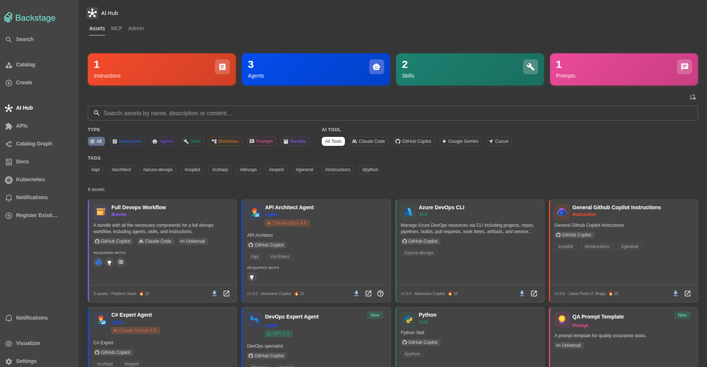

# Dev AI Hub — Backstage Plugin

A centralized hub for AI assets — Instructions, Agents, Skills, and Workflows — usable by **GitHub Copilot**, **Claude Code**, **Google Gemini**, **Cursor**, and other AI coding tools.

The plugin syncs one or more Git repositories as the source of truth, stores assets in your Backstage database, exposes them via a UI, and serves them through an embedded **MCP (Model Context Protocol) server** so AI tools can discover and install assets automatically.




https://github.com/user-attachments/assets/5728807d-2587-408b-88f2-4c2853606285

---

## Installation

### 1. Copy plugin packages

Copy the four plugin directories into your Backstage monorepo's `plugins/` folder:

```
plugins/
  dev-ai-hub/
  dev-ai-hub-backend/
  dev-ai-hub-common/
  dev-ai-hub-node/
```

Then install:

```bash
yarn install
```

### 2. Register the backend plugin

In `packages/backend/src/index.ts`:

```typescript
backend.add(import('@internal/plugin-dev-ai-hub-backend'));
```

### 3. Register the frontend plugin

#### New Frontend System (NFS)

In `packages/app/src/App.tsx`:

```typescript
import { devAiHubPlugin } from '@internal/plugin-dev-ai-hub';

const app = createApp({
  features: [
    // ...existing features
    devAiHubPlugin,
  ],
});
```

The sidebar item is registered automatically — no additional configuration needed.

#### Legacy frontend system

In `packages/app/src/App.tsx`, add the route inside `<FlatRoutes>`:

```typescript
import { DevAiHubPage } from '@internal/plugin-dev-ai-hub';

// inside <FlatRoutes>:
<Route path="/dev-ai-hub" element={<DevAiHubPage />} />
```

In `packages/app/src/components/Root/Root.tsx`, add the sidebar item:

```typescript
import HubIcon from '@mui/icons-material/Hub';

// inside <SidebarGroup>:
<SidebarItem icon={HubIcon} to="dev-ai-hub" text="AI Hub" />
```

The API client is registered automatically when `DevAiHubPage` is used — no extra plugin registration needed.

### 4. Configure `app-config.yaml`

```yaml
devAiHub:
  providers:
    - id: "main-ai-assets"
      type: "github"                                          # github | gitlab | bitbucket | azure-devops | git
      target: "https://github.com/your-org/ai-assets.git"
      branch: "main"
      schedule:
        frequency:
          minutes: 30
        timeout:
          minutes: 5

# Required: Git integration for reading repositories
integrations:
  github:
    - host: github.com
      token: ${GITHUB_TOKEN}
```

See `app-config.example.yaml` for more provider examples (GitLab, Bitbucket, filters).

---

## Asset Format

Each AI asset is two files with the same base name in your repository:

```
agents/
  product-manager.yaml   ← metadata envelope
  product-manager.md     ← pure markdown content (never modified by the plugin)
instructions/
  security-guidelines.yaml
  security-guidelines.md
skills/
  code-review/
    code-review.yaml
    SKILL.md
workflows/
  pr-review.yaml
  pr-review.md
```

### YAML envelope (`<name>.yaml`)

```yaml
name: product-manager-agent
label: Product Manager Agent
description: AI agent specialized in product management tasks
type: agent                          # instruction | agent | skill | workflow
tools:
  - github-copilot
tags:
  - product
  - planning
author: Your Name
version: 1.0.0

# Optional: override install path per tool
# installPath: ".claude/agents/product-manager.md"
# installPaths:
#   claude-code: ".claude/agents/product-manager.md"
#   github-copilot: ".github/agents/product-manager.agent.md"
```

If `content` is omitted, the parser looks for `<same-name>.md` in the same directory. For skills, it defaults to `SKILL.md`.

Use `tools: [all]` for tool-agnostic assets that should appear for every tool.

For more information about YAML envelope fields, see [YAML Envelope Reference](examples/envelop-manual.md).

You can use assets in examples folder to see how to use assets in your project or as a base for your own assets.

### Default install paths (auto-resolved per tool)

| Type | Tool | Default path |
|------|------|-------------|
| `instruction` | `claude-code` | `.claude/rules/<name>.md` |
| `instruction` | `github-copilot` | `.github/instructions/<name>.instructions.md` |
| `instruction` | `google-gemini` | `GEMINI.md` |
| `instruction` | `cursor` | `.cursor/rules/<name>.mdc` |
| `agent` | `claude-code` | `.claude/agents/<name>.md` |
| `agent` | `github-copilot` | `.github/agents/<name>.agent.md` |
| `skill` | `claude-code` | `.claude/skills/<name>/SKILL.md` |
| `skill` | `cursor` | `.cursor/skills/<name>/SKILL.md` |
| `workflow` | `claude-code` | `.claude/workflows/<name>.md` |
| `workflow` | `github-copilot` | `.github/workflows/<name>.workflow.md` |

---

## MCP Server

The MCP server runs **embedded** in the Backstage backend — no separate process needed. It uses the StreamableHTTP transport.

**URL:** `http://<backstage-host>:7007/api/dev-ai-hub/mcp`

The `?tool=` query parameter filters which assets the AI tool receives. Omit it to receive all assets.
The `?provider=` query parameter filters which assets the AI tool receives. Omit it to receive all assets.
The `?proactive=true` query parameter enable proactive mode. This mode is used to provide assets to the AI tool automatically when it is needed.

### Claude Code

In `.mcp.json` or `~/.claude/mcp.json`:

```json
{
  "mcpServers": {
    "dev-ai-hub": {
      "type": "http",
      "url": "http://<backstage-host>:7007/api/dev-ai-hub/mcp?tool=claude-code"
    }
  }
}
```

### GitHub Copilot (VS Code)

In `.vscode/settings.json` or VS Code user settings:

```json
{
  "github.copilot.chat.mcp.servers": {
    "dev-ai-hub": {
      "type": "http",
      "url": "http://<backstage-host>:7007/api/dev-ai-hub/mcp?tool=github-copilot"
    }
  }
}
```

### Google Gemini CLI

In `~/.gemini/settings.json`:

```json
{
  "mcpServers": {
    "dev-ai-hub": {
      "type": "http",
      "url": "http://<backstage-host>:7007/api/dev-ai-hub/mcp?tool=google-gemini"
    }
  }
}
```

### Cursor

In `.cursor/mcp.json`:

```json
{
  "mcpServers": {
    "dev-ai-hub": {
      "type": "http",
      "url": "http://<backstage-host>:7007/api/dev-ai-hub/mcp?tool=cursor"
    }
  }
}
```

### Available MCP tools

| Tool | Description |
|------|-------------|
| `list_assets` | List assets, optionally filtered by type. Supports pagination  |
| `search_assets` | Full-text search across name, description, and content. Supports type and tag filters |
| `get_asset` | Get full metadata and markdown content by exact ID or partial name match |
| `install_asset` | Returns content + recommended install path for the active tool; the model writes the file. Increments the install counter |
| `get_popular` | Returns the most-installed assets, optionally filtered by type |
| `list_providers`| Lists all configured repositories with their sync status, asset count, and last sync time |
| `suggest_assets` ⚡ | Proactively suggests assets based on a project context description. Only available when ?proactive=true |

### Available MCP prompts

| Prompt | Description |
|------|-------------|
| `check_for_assets` ⚡ | Instructs the model to call suggest_assets with the current task context and offer to install relevant assets before starting work. Only available when ?proactive=true  |

 ⚡ Proactive-only — registered only when the MCP URL includes ?proactive=true.

Usage examples in chat:

> "List the available agents in Dev AI Hub"
> "Search for a code review asset in the hub"
> "Install the Product Manager agent in this project"

---

## REST API

```
GET  /api/dev-ai-hub/assets                   List assets (filters: type, tool, tags, search, provider, page, pageSize)
GET  /api/dev-ai-hub/assets/:id               Asset detail
GET  /api/dev-ai-hub/assets/:id/raw           Pure markdown content
GET  /api/dev-ai-hub/assets/:id/download      Download as .md or .zip (skills)
POST /api/dev-ai-hub/assets/:id/track-install Increment install counter
GET  /api/dev-ai-hub/providers                List configured providers with sync status
POST /api/dev-ai-hub/providers/:id/sync       Trigger manual sync
GET  /api/dev-ai-hub/stats                    Totals by type, tool, and provider

POST   /api/dev-ai-hub/mcp                    Initialize MCP session or handle existing
GET    /api/dev-ai-hub/mcp                    SSE stream for server-to-client notifications
DELETE /api/dev-ai-hub/mcp                    Terminate MCP session
```

---

## Package Structure

| Package | Role | Description |
|---------|------|-------------|
| `@internal/plugin-dev-ai-hub` | `frontend-plugin` | React UI — page, cards, filters, install dialog |
| `@internal/plugin-dev-ai-hub-backend` | `backend-plugin` | Sync service, REST API, embedded MCP server |
| `@internal/plugin-dev-ai-hub-common` | `common-library` | Shared TypeScript types, Zod schemas, install path conventions |
| `@internal/plugin-dev-ai-hub-node` | `node-library` | Extension points for external provider modules |

---

## License

Apache-2.0
